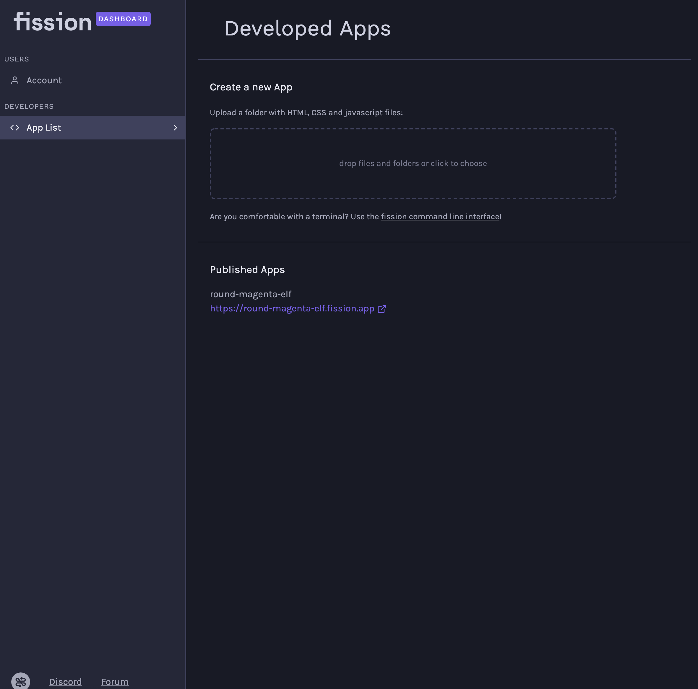

# App Management


There is a live beta of the development version available at [https://dashboard-develop.fission.app/](https://dashboard-develop.fission.app/). It might delete your apps or eat your JavaScript.


All of the apps that you have published with your account are listed on the Apps page.

### Create a new app from the Dashboard

As well as using the [Fission CLI](../../developers/cli/) to register and publish apps, you can drag and drop a folder of HTML, CSS, and JavaScript files to create and publish your app directly from the browser.

