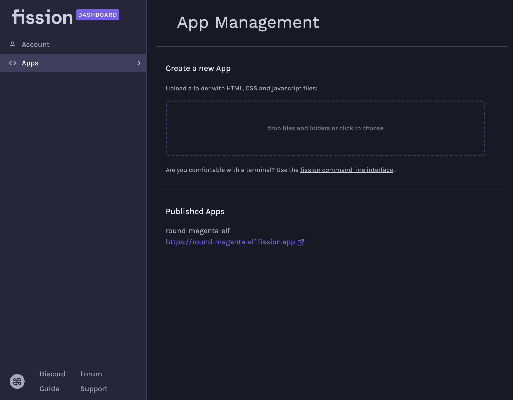
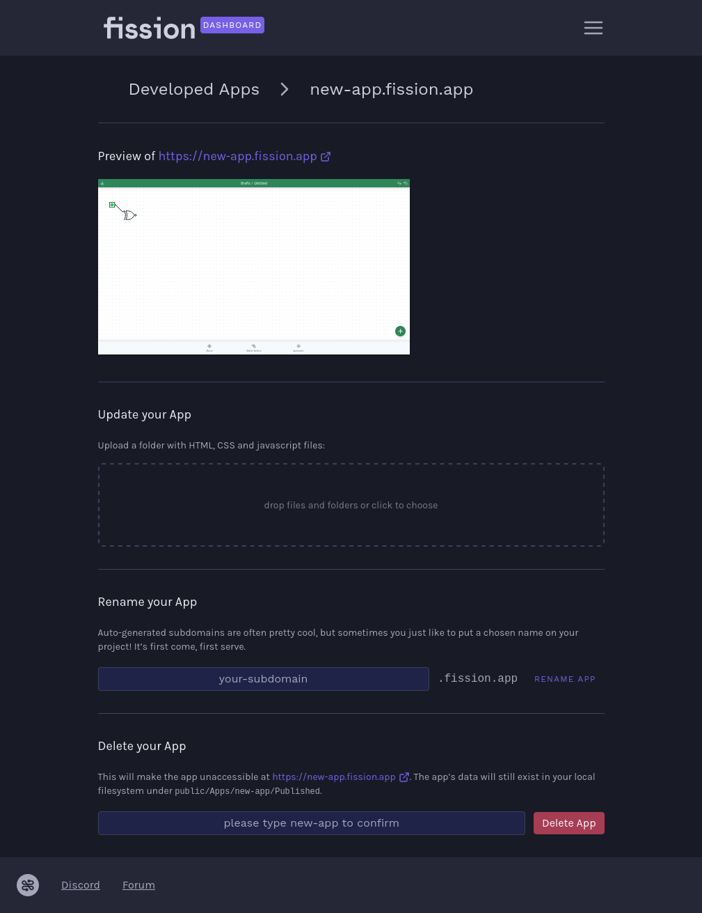

# App Management


There is a live beta of the development version available at [https://dashboard-develop.fission.app/](https://dashboard-develop.fission.app/). It might delete your apps or eat your JavaScript.


All of the apps that you have published with your account are listed on the Apps page.

## Create a new app from the Dashboard

As well as using the [Fission CLI](../../developers/cli/) to register and publish apps, you can drag and drop a folder of HTML, CSS, and JavaScript files to create and publish your app directly from the browser.


Behaviour between drag-and-drop and the file chooser differs slightly!

* If you upload files via drag-and-drop, e.g. by selecting the files `index.html` and `styles.css` and dropping both, you'll end up with these two files at the root of your app, so e.g. at your-app.fission.app/index.html.
* If you upload files via clicking on the drop area, you'll open a directory chooser. There, select the directory that contains all files you want to have served on your app. So, e.g. choose the `build` directory that _contains_ the `index.html` and `styles.css` files.


## Manage apps you've created

When you click on an app in your [apps list](https://dashboard.fission.codes/#developers/apps), you get to a page you can update, rename or delete your apps on.

