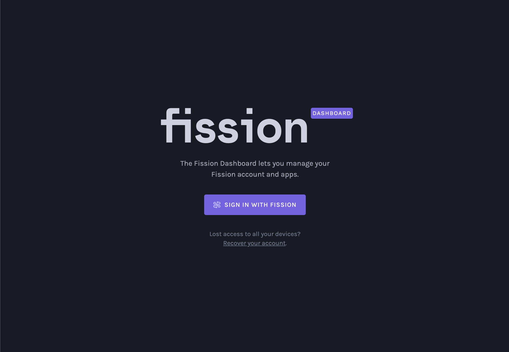
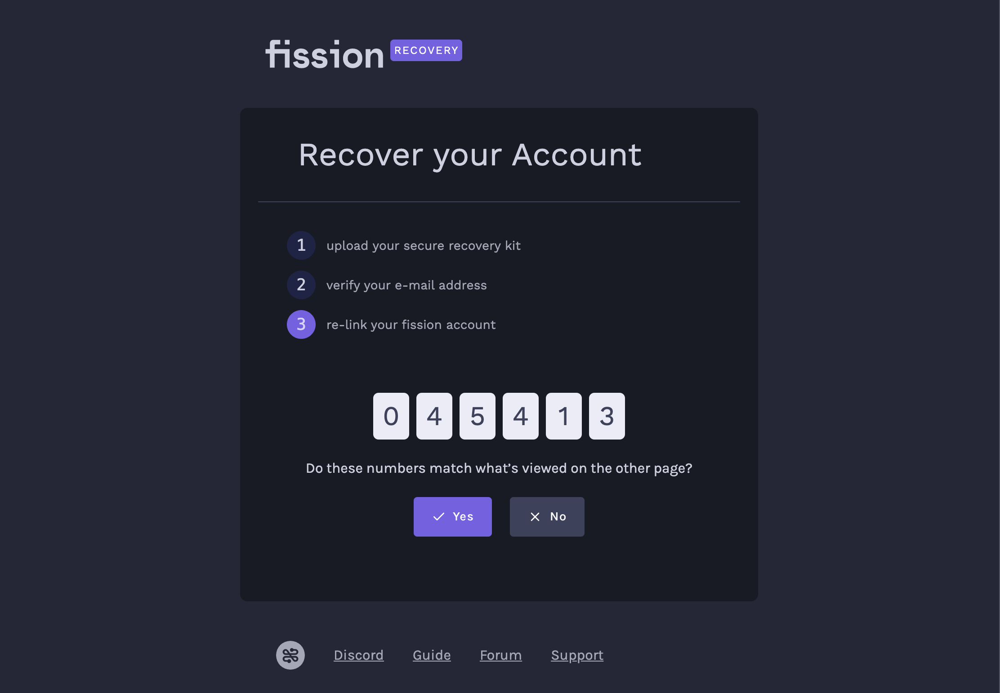

# Account Recovery

Fission users can recover a lost account with a Recovery Kit. You can create a Recovery Kit in the Fission Dashboard to ensure you will always have access to your account.


Account recovery is only needed when you do not have any linked devices. If you have lost access on one device, but are still signed in on another device, you can use [account linking](account-linking.md#web-linking) instead.


### Make a Recovery Kit

Sign in to the [Fission Dashboard](https://dashboard.fission.codes/) and select Recovery Kit.

To create a Recovery Kit, you need to grant the Fission Dashboard access to your private files. This step is necessary for the Dashboard to recover your private files.

Allow creating a recovery kit and grant permission in the Fission Auth Lobby.

After granting permission, you can create a Recovery Kit.

The recovery kit should be stored somewhere safe. Anyone with access to your Recovery Kit can access your private files. If you lose your Recovery Kit, you will not be able to recover your account.

Download your Recovery Kit and save it somewhere safe. 

We recommend you store it on a device or storage medium that you will not easily lose.

### Recover your Account

If you have lost access to your account, you can recover it with a Recovery Kit from the Fission Dashboard.

Select the Recover your account option below the sign in button. 

You will need your Recovery Kit and access to the email you used to create the account.

Drag your recovery kit onto the upload box or click the box to select it from your file system. Fission Dashboard will import your recovery kit.

After Fission Dashboard imports your Recovery Kit, select send email.

Fission will send you verification email. Click on the link in the email and the recovery page will give you an option to recover your account.

Select recover account and re-link your account by signing into the Fission Auth Lobby. 

Make sure to keep the recovery page open while you re-link your account.

The Fission Auth Lobby and account recovery page will show you confirmation codes.

When you are satisfied that the codes match, confirm in the account recovery page.

After confirming, Fission will recover your account, and you can access your files again.

Your Recovery Kit will work again if you need to recover your account in the future.

