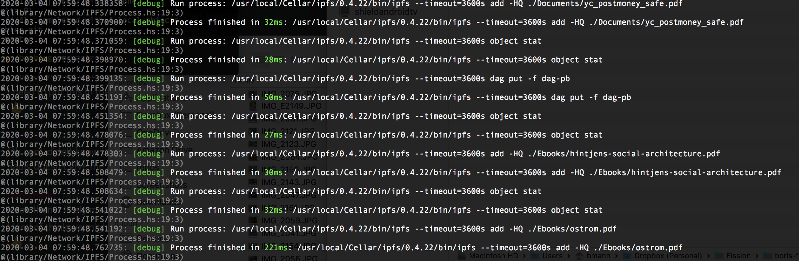
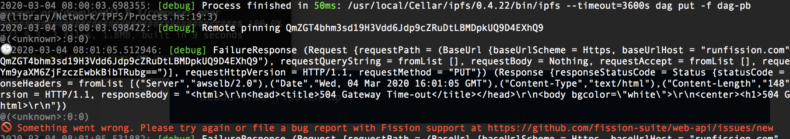

# Troubleshooting

## Maximum Open Files on Ubuntu, Mac OS, ChromeOS

We've had a report with uploading large numbers of files using `ipfs-deploy` with Fission support that you may need to increase the number of open files that your operating system supports. This could also occur with `fission watch`.

For ubuntu, read [underyx's article to increase the number of open files allowed](https://underyx.me/articles/raising-the-maximum-number-of-file-descriptors).

For Mac OS, [Wilson Mar](https://wilsonmar.github.io/maximum-limits/) has a one liner:

```text
sudo launchctl limit maxfiles 65536 200000
```

As [described in the article,](https://wilsonmar.github.io/maximum-limits/) you'll want to add it to your bash or other shell profile so this change is permanent.

On a Chromebook in the native ChromeOS shell? Yeah, [Boris hit this issue too when running large jekyll or gatsby builds](https://wiki.bmann.ca/chromebook#increase-inotify):

```text
sudo sysctl fs.inotify.max_user_watches=1048576
```

## Re-installing brew on Mac

We've had some hiccups with our brew formula recently. To re-install / reset brew, run the following:

```text
brew untap fission-suite/fission
```

Now re-run the [installation instructions](https://guide.fission.codes/installation#macos), copied here for convenience:

```text
brew tap fission-suite/fission
brew install fission-cli
```

This is related to [issue \#37](https://github.com/fission-suite/cli/issues/37).

## DEBUG mode for fission cli

If you want to see what the [Fission CLI](../apps/cli.md) is doing under the covers, you can turn on DEBUG mode by calling commands like this:

```text
DEBUG=true fission up .
```

You'll see that `fission up` calls your locally installed `ipfs` command to add files to IPFS. We can see that it's using the 0.4.22 version of ipfs, installed using Homebrew in the "Cellar" where brew keeps installed items.



Then, it sends the hash of the entire directory to our web API, which pins it and fetches the files directly from your laptop and any other IPFS nodes that already have copies of those files in the network.



In this case, we can see that after the "Remote pinning Qm…", there is a _504 Gateway Time-out_ error from our server. This is a known issue, which we're working on to support large files / large quantities of files.

## Running IPFS as a service on Linux and WSL <a id="initd"></a>

WSL doesn't have systemd, so this init.d script should work.



## Fission Peer Addresses

The Fission CLI automatically connects your local IPFS server to our peers. It does this by issuing the `ipfs swarm connect` command \([see IPFS docs](https://docs.ipfs.io/reference/cli/#ipfs-swarm-connect)\). Running the following two commands will open a direct connection to the Fission peers.

```text
ipfs swarm connect /ip4/3.215.160.238/tcp/4001/ipfs/QmVLEz2SxoNiFnuyLpbXsH6SvjPTrHNMU88vCQZyhgBzgw
ipfs swarm connect /ip4/3.226.224.78/tcp/4001/ipfs/QmXab6bcjmWUQZryEtmZfxS5hGoJAguw8bhLdUN5ZFQ2e5
```

