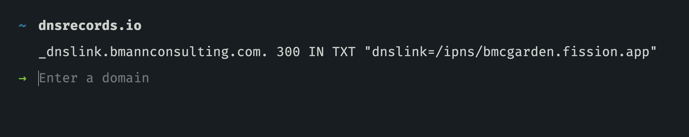

# Troubleshooting

## Check your DNS

To check the setup of your DNS for [Custom Domains](../developers/custom-domains/control-own-dns.md), you can run this `dig` command:

```
dig -t txt short _dnslink.junior-angular-tulip.fission.app
```

The "short" option is still pretty long! We're just looking for the ANSWER section:

```
;; ANSWER SECTION:
_dnslink.junior-angular-tulip.fission.app. 9 IN	TXT "dnslink=/ipfs/QmafcCaym2UZ46oKDoSQs7UkHVPpeKTVTES2GN5icuvKQv"
```

You can also check records online using the very handy dnsrecords.io. See this example for `_dnslink.bmannconsulting.com` which just shows us the TXT record we're looking for:



## Maximum Open Files on Ubuntu, Mac OS, ChromeOS

We've had a report with uploading large numbers of files using `ipfs-deploy` with Fission support that you may need to increase the number of open files that your operating system supports. This could also occur with `fission watch`.

For ubuntu, read [underyx's article to increase the number of open files allowed](https://underyx.me/articles/raising-the-maximum-number-of-file-descriptors).

For Mac OS, [Wilson Mar](https://wilsonmar.github.io/maximum-limits/) has a one liner:

```
sudo launchctl limit maxfiles 65536 200000
```

As [described in the article,](https://wilsonmar.github.io/maximum-limits/) you'll want to add it to your bash or other shell profile so this change is permanent.

On a Chromebook in the native ChromeOS shell? Yeah, [Boris hit this issue too when running large jekyll or gatsby builds](https://wiki.bmann.ca/chromebook#increase-inotify):

```
sudo sysctl fs.inotify.max_user_watches=1048576
```

## Re-installing brew on Mac

We've had some hiccups with our brew formula recently. To re-install / reset brew, run the following:

```
brew uninstall
brew untap fission-suite/fission
```

Now re-run the [installation instructions](https://guide.fission.codes/installation#macos), copied here for convenience:

```
brew tap fission-codes/fission
brew install fission-cli
```


Note: we changed from `fission-suite` to `fission-codes`, so you'll need to follow the steps above to get on the new packages.


This is related to [issue #37](https://github.com/fission-suite/cli/issues/37).

## DEBUG mode for fission cli

If you want to see what the [Fission CLI](../developers/cli/) is doing under the covers, you can turn on DEBUG mode by calling commands like this:

```
DEBUG=true fission up .
```

You'll see that `fission up` calls your locally installed `ipfs` command to add files to IPFS. We can see that it's using the 0.4.22 version of ipfs, installed using Homebrew in the "Cellar" where brew keeps installed items.


Then, it sends the hash of the entire directory to our web API, which pins it and fetches the files directly from your laptop and any other IPFS nodes that already have copies of those files in the network.


In this case, we can see that after the "Remote pinning Qm…", there is a _504 Gateway Time-out_ error from our server. This is a known issue, which we're working on to support large files / large quantities of files.


The `--verbose` flag can be run on most commands these days. [See the CLI docs for working with apps](../developers/cli/working-with-apps.md) for more info.


## Ports for Managed Fission IPFS Node

The fission CLI installs a managed IPFS node. It runs on port `10235`.
