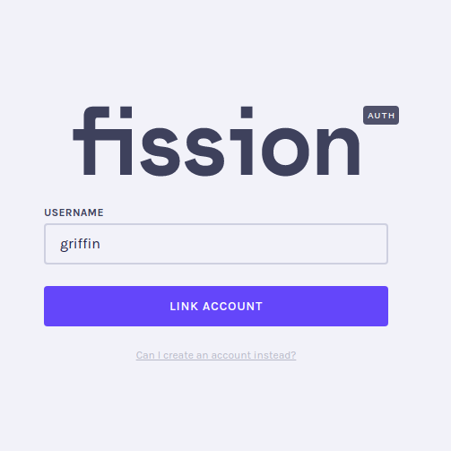

# Managing Your Account

Use `fission setup`, `fission user whoami`, and `fission login` to set up your account, display your username, and link your account in web browser.

## Register a new user

The `fission setup` command registers your account with Fission or links to your existing Fission account.

```text
$ fission setup
🌱 Setting up environment
🪐 Downloading managed IPFS for Linux
🎛️  Configuring managed IPFS
generating ED25519 keypair...done
peer identity: 12D3KooWHZ3C1tDmzUhgi3A6LYmgBxvv1E1obtG7S2ZkYM1MN83
initializing IPFS node at /home/yourname/.config/fission/ipfs
🔑 Creating keys
🏠 Do you have an existing account? [Y/n] n
Username: YOURNAME
Email: yourname@example.com
✅ Registration successful! Head over to your email to confirm your account.
🎛️  Initializing user config file
✅ Done! Welcome to Fission, YOURNAME ✨.
```

When you register a new account, you will be prompted for a username and an email. Fission will send you an email to confirm your account and complete your registration.

The `fission setup` command will create a global `config.yaml` file in your `~/.config/fission` directory. See the [Global Fission YAML](fission-yaml.md#global-fission-yaml) guide for more information about the `config.yaml` file.

The registration process will also create a [Fission Drive](../../drive/preview.md) for you automatically at the URL `YOURNAME.fission.name` using your Fission username.

## Display user information

Use `fission user whoami` to display your username.

```bash
$ fission user whoami
💻 Currently logged in as: fission
```

## Linking a web browser

You can link your Fission account in a web browser to interact with Fission-enabled apps. The `fission login` command sets up the CLI to listen for requests to link your account.

```text
$ fission login
🕚🌐 Listening for logins requests for griffin
```

Open the [Fission auth lobby](https://auth.fission.codes) in a browser window, select "Sign In", enter your Fission username, and select "Link Account".



The browser window and command line will display confirmation codes. Verify that the confirmation codes match and grant access at the command line.


```text
$ fission login
🕚🌐 Listening for logins requests for griffin
🔢  Does this code match your second device? [4, 4, 5, 3, 0, 7] [Y/n] Y
🧞 Grant access? SuperUser all resources, from Tue, 11 May 2021 15:30:01 UTC until 
Fri, 10 Mar 2276 15:30:31 UTC [Y/n] Y
🤝 Login to other device successful 🎉
```

The browser window will update to show that you have successfully linked your account.


## Linking from a web account

If you are signed into a Fission account in a web browser, you can link your account and use it at the command line.

Open the [Fission auth lobby](https://auth.fission.codes/)  in a browser window.


Use `fission setup` to create and link a CLI user at your command line.

```text
$ fission setup
🌱 Setting up environment
🪐 Downloading managed IPFS for Linux
🎛️  Configuring managed IPFS
generating ED25519 keypair...done
peer identity: 12D3KooWHZ3C1tDmzUhgi3A6LYmgBxvv1E1obtG7S2ZkYM1MN83
initializing IPFS node at /home/thuselem/.config/fission/ipfs
🔑 Creating keys
🏠 Do you have an existing account? [Y/n] Y
🔗 Please open auth.fission.codes on a signed-in device
📛 Please enter your username: yeti
```

When prompted, enter `Y` to confirm you have an account and enter your username from the browser window. The auth lobby and CLI will display a confirmation code.


When you have confirmed that the codes match, approve in the browser, and the CLI will complete the setup process and link your account. 

```text
$ fission setup
🌱 Setting up environment
🪐 Downloading managed IPFS for Linux
🎛️  Configuring managed IPFS
generating ED25519 keypair...done
peer identity: 12D3KooWHZ3C1tDmzUhgi3A6LYmgBxvv1E1obtG7S2ZkYM1MN83
initializing IPFS node at /home/thuselem/.config/fission/ipfs
🔑 Creating keys
🏠 Do you have an existing account? [Y/n] Y
🔗 Please open auth.fission.codes on a signed-in device
📛 Please enter your username: yeti
🔢 Confirmation code: [6, 0, 9, 1, 2, 3]
🎛️  Initializing user config file
```

