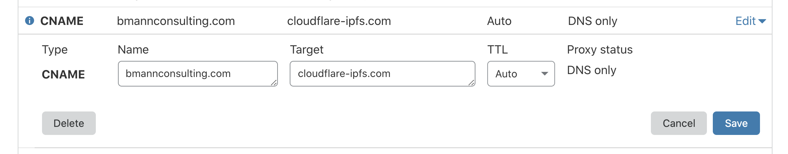
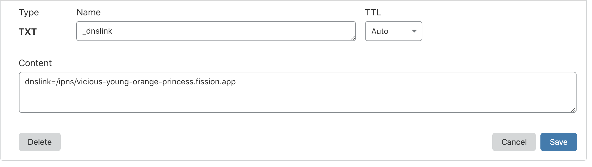

# Using Cloudflare IPFS Gateway

By using Cloudflare as your DNS provider and their [IPFS gateway](https://www.cloudflare.com/distributed-web-gateway/), you can deploy on Fission but have your content be served by Cloudflare. This will let you use custom domains with your Fission apps while we work to automate the process fully on the platform.

### Add a CNAME pointing to Cloudflare's IPFS gateway

For your domain, `YOURAPPDOMAIN.com`, go into your DNS provider control panel and add a CNAME pointing to `cloudflare-ipfs.com`.

| Record | Type | Value |
| :---: | :---: | :---: |
| @ | CNAME | `cloudflare-ipfs.com` |

Since your domain is already hosted with Cloudflare, there's no step two: they'll add SSL support to it automatically, and turn off proxying.

### Add a TXT record with dnslink

Now, add a TXT record pointing to your app subdomain. Your APPNAME is created when you run `fission app register`, and will look something like `junior-angular-tulip` . We're creating a link to say that the content from that app should be served up at your domain with a special dnslink record:

| Record | Type | Value |
| :---: | :---: | :---: |
| \_dnslink | TXT |  `dnslink=/ipns/APPNAME.fission.app` |

That's it, you're done!

Whenever you publish a new version of your Fission app, we update the hash that this special record points to. When you go to `YOURAPPDOMAIN.com`, Cloudflare's gateway looks up this `_dnslink` record, checks the ipns record, gets the hash, and fetches the content from the global IPFS network. This might even be from your computer directly.


When we initially tested this, the Cloudflare gateway was caching for up to 6 hours. It seems to only take a few minutes at most to show updated content now, but it won't be instant like using Fission directly.


