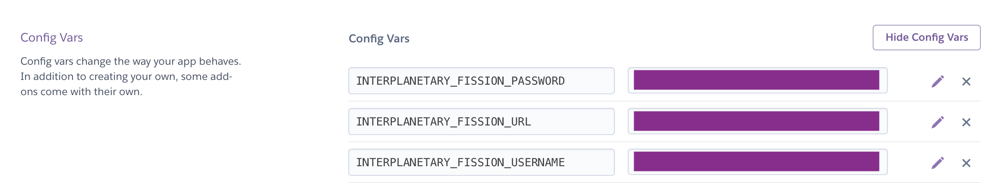

# Heroku Add-on

The Fission Web API is available as a Heroku Add-on. [Find it in the Heroku Add-Ons Marketplace](https://elements.heroku.com/addons/interplanetary-fission). It is currently in a free beta mode with a "test" plan. 

As with all Heroku add-ons, you can also create a new add-on locally using the Heroku CLI tool:

```text
heroku addons:create interplanetary-fission:test
```

If you create the add-on through the Heroku dashboard, you can find your API credentials in the _Settings_ section of your app, under the _Config Vars_ heading:



These can also be used in your local environment by creating an `.env` file.


The Heroku Add-on uses the Web API, appropriate for server side apps written in any language that Heroku supports. You can browse the live docs of the Fission Web API at [runfission.com/docs](https://runfission.com/docs), or look at our [Github repo](https://github.com/fission-suite) to find a client SDK for your programming language.


### Deploy to Heroku

A particularly good use case for using our Fission IPFS add-on is to combine it with setting up your application in a "Deploy to Heroku" mode.

This means adding an `app.json` file and a few other settings that tell Heroku what add-ons and environment variables your application needs. You can find out more [how to set this up in Heroku's documentation](https://devcenter.heroku.com/articles/heroku-button).

### Example Deploy to Heroku Apps

#### Ghost Blogging on Heroku with IPFS

We built an [IPFS Storage Adapter for the Ghost blogging platform](https://github.com/fission-suite/ghost-storage-adapter-ipfs), and bundled it together with **Deploy to Heroku** and the **Fission Heroku Add On**. You can get started on the hobby tier by clicking the Deploy to Heroku button on Github:

* [https://github.com/fission-suite/heroku-ipfs-ghost](https://github.com/fission-suite/heroku-ipfs-ghost)

