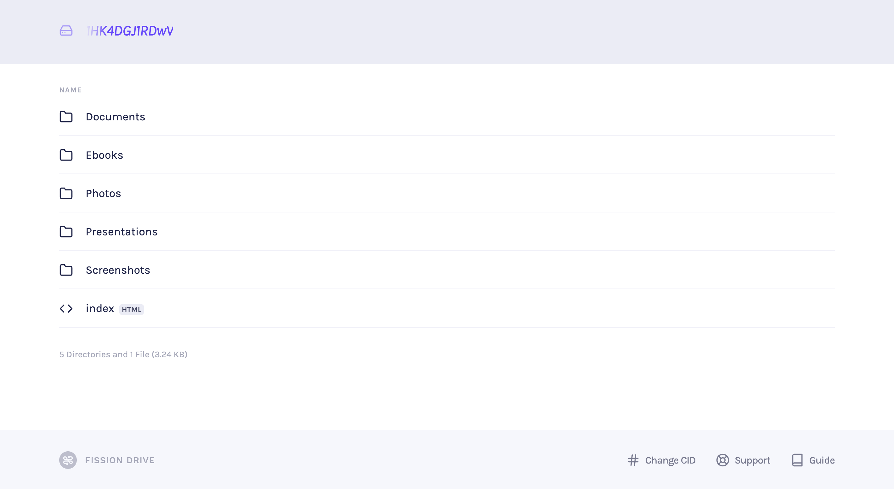
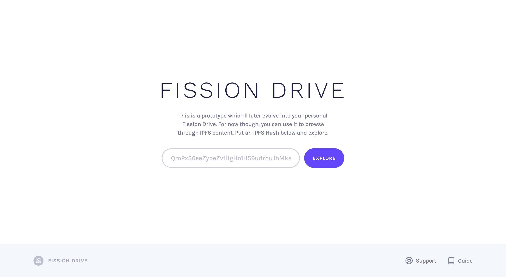
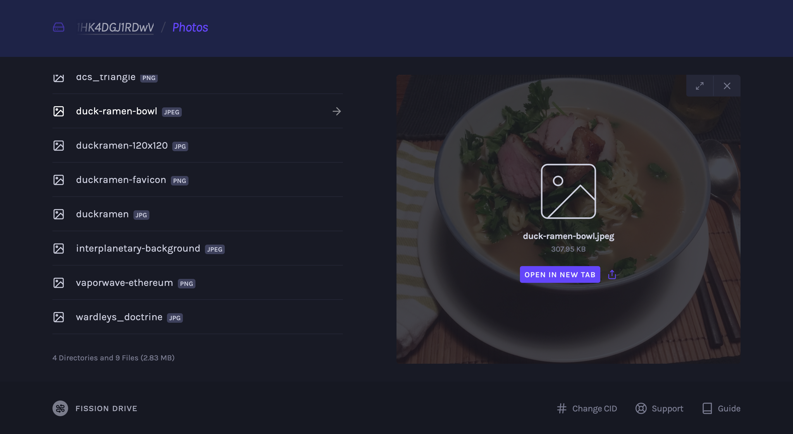
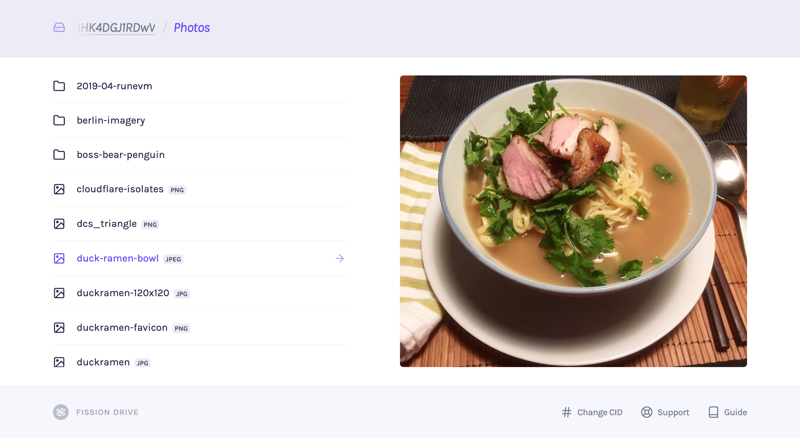

# Preview

**Fission Drive** is currently a Preview release of our upcoming file storage and identity system that lets you take your files anywhere, encrypted end-to-end as well as for public hosting of files, websites, and apps.

The Preview release is an exploration of the interface, and currently supports only public files. 

### Enter any IPFS Hash

You can browse any IPFS directory, not just those hosted on Fission, by entering in the hash, or Content ID \(CID\), of a directory.

## Features

### Dark & Light Mode

Preview supports system wide / browser settings for dark vs. light mode and will switch automatically when you change those settings.


Note: ChromeOS does not currently support dark mode.


### Image Previews

