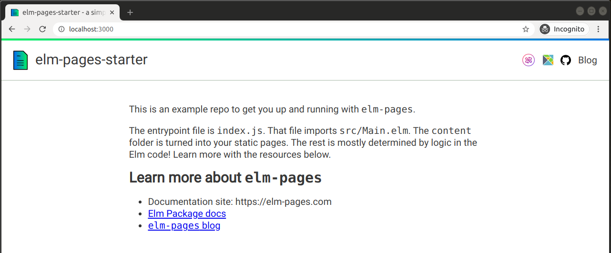
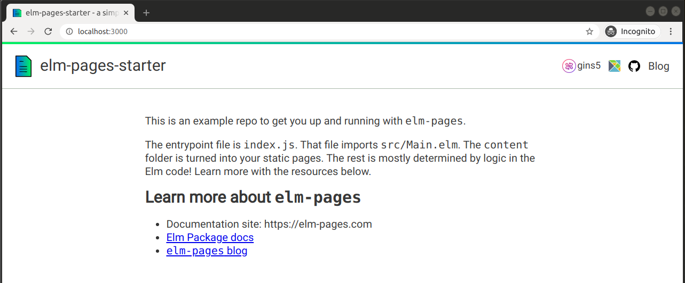

# Adding auth to an elm-pages app

In this guide, we will add Fission auth to the `elm-pages-starter`. We will add a login button to the navbar that redirects users to the Fission auth lobby. After a user authenticates in the lobby, we will log them in and display their Fission username.

All of the code in this guide is available in the [fission-elm-pages-starter](https://github.com/bgins/fission-elm-pages-starter/tree/auth) repository on the `auth` branch.

Before authentication, our header has a Fission login button.



After authentication, we show a username next to the button.



We will use the Fission [web native](https://www.npmjs.com/package/webnative) package to authenticate users. Our Elm app will request a login over an outgoing port and subscribe to authentication changes over an incoming port.

> **Users own their data.** All Fission services are designed on the principle that users should own their data. When users own their identity, developers no longer need to maintain user accounts and authentication becomes simple to implement. See [Compute, Storage, and Identity Foundations](https://guide.fission.codes/webnative-sdk/web-native-introduction/compute-storage-identity) in our guide for more information on identity.

### Add username and login

Our login button will be added to `Layout.elm`, but we will start by adding our authentication logic and state in `Main.elm`.

Let's start by adding a `username` to our model.

```text
type alias Model =
    { username : Maybe String }


init : ( Model, Cmd Msg )
init =
    ( { username = Nothing }
    , Cmd.none
    )
```

Note that we always start without a username. We will check for an authenticated user after initialization.

Add a `SubmittedLogin` message for when a user clicks the login button and a `GotAuth` message to respond to authentication changes.

```text
type Msg
    = SubmittedLogin
    | GotAuth (Maybe String)


update : Msg -> Model -> ( Model, Cmd Msg )
update msg model =
    case msg of
        SubmittedLogin ->
            ( model
            , login ()
            )

        GotAuth maybeUsername ->
            ( { model | username = maybeUsername }
            , Cmd.none
            )
```

Add an outgoing `login` port and an incoming `onFissionAuth` port.

```text
port login : () -> Cmd msg


port onFissionAuth : (Json.Decode.Value -> msg) -> Sub msg
```

Add a subscription to `onFissionAuth`.

```text
subscriptions : Model -> Sub Msg
subscriptions _ =
    onFissionAuth
        (\val ->
            Json.Decode.decodeValue authDecoder val
                |> Result.toMaybe
                |> GotAuth
        )


authDecoder : Json.Decode.Decoder String
authDecoder =
    Json.Decode.field "username" Json.Decode.string
```

We expect JSON that should look something like `{ username: "fission-username" }`. After decoding the value, we call `GotAuth` with a `Just username` on success or `Nothing` on failure.

> ⚠️ **Nothing on failure?** In a real application, we would want to add error reporting and handling. We silently fail here to keep our example simple.

### Add the login button

Our `model`, `update`, and `subscriptions` are ready to go! Now let's add the login button to the navbar.

In `Main.elm`, pass the `SubmittedLogin` message and `model.username` to `Layout.view`

```text
Layout.view
    (pageView model siteMetadata page viewForPage)
    page
    { loginMsg = SubmittedLogin, username = model.username }
```

In `Layout.elm`, modify `view` to accept the new parameter and call it `fissionAuth`.

```text
view :
    { title : String, body : List (Element msg) }
    ->
        { path : PagePath Pages.PathKey
        , frontmatter : Metadata
        }
    ->
        { loginMsg : msg
        , username : Maybe String
        }
    -> { title : String, body : Html msg }
view document page fissionAuth =
    { title = document.title
    , body =
        Element.column
            [ Element.width Element.fill ]
            [ header page.path fissionAuth
            ...
    }
```

Pass `fissionAuth` through `header` to a new `fissionAuthButton` displayed alongside the Elm docs and GitHub links.

```text
, Element.row [ Element.spacing 15 ]
    [ fissionAuthButton fissionAuth
    , elmDocsLink
    , githubRepoLink
    , highlightableLink currentPath Pages.pages.blog.directory "Blog"
    ]
```

```text
fissionAuthButton : { loginMsg : msg, username : Maybe String } -> Element msg
fissionAuthButton fissionAuth =
    Element.Input.button
        []
        { onPress = Just fissionAuth.loginMsg
        , label =
            Element.row
                [ Element.spacing 2
                , Font.size 18
                ]
                [ Element.image
                    [ Element.width (Element.px 26)
                    ]
                    { src = ImagePath.toString Pages.images.fission
                    , description = "Login with Fission"
                    }
                , case fissionAuth.username of
                    Just username ->
                        Element.text username

                    Nothing ->
                        Element.none
                ]
        }
```

We call `SubmittedLogin` when a user clicks the `fissionAuthButton` and display their `username` if they are logged in.

### Add webnative auth

All of our Elm code is written and we only need a small bit of JavaScript to authenticate users with Fission.

Our desired authentication flow looks like this:

1. A user clicks on the Fission button
2. They authenticate in the Fission auth lobby
3. They are redirected back to our page in an authenticated state
4. The next time they visit our site, they should already be authenticated

Let's start by installing the `webantive` package from npm.

```text
npm install webnative
```

Import it in `index.js`.

```text
import * as webnative from 'webnative';
```

After our Elm app is initialized, we can bring `webnative` together with our `login` and `onFissionAuth` ports to authenticate users.

```text
const fissionInit = {
  permissions: {
    app: {
      name: 'fission-elm-pages-starter',
      creator: 'bgins'
    }
  }
};

pagesInit({
  mainElmModule: Elm.Main
}).then(app => {
  webnative.initialize(fissionInit).then(async state => {
    switch (state.scenario) {
      case webnative.Scenario.AuthSucceeded:
      case webnative.Scenario.Continuation:
        app.ports.onFissionAuth.send({ username: state.username });
        break;

      case webnative.Scenario.NotAuthorised:
      case webnative.Scenario.AuthCancelled:
        break;
    }

    app.ports.login.subscribe(() => {
      webnative.redirectToLobby(state.permissions);
    });
  });
});
```

Initializing `webnative` gives us access to `state` which has a `state.username` and a `state.scenario`. The `state.scenario` tells us if the user is authenticated or not.

If a user just returned from the Fission auth lobby, `state.scenario` will be `webnative.Scenario.AuthSucceeded`. If they authenticated on a previous visit, `state.scenario` will be `webnative.Scenario.Continuation`. In both cases, we have a `state.username` to pass through the `onFissionAuth` port.

The `login` port calls on `webnative` to redirect the user to the Fission auth lobby. When the user returns from the lobby, we will initialize and check authentication status all over again.

### Authentication complete 🤖

That's it! User identity is held by your users in browser storage and you won't need a backend to manage it. A user that has authenticated with Fission also has a `webnative` file system where your app can store their data. In the next section, we will show how to use it.

Here are a couple of resources on Fission auth for a deeper dive into how this all works:

* [UCAN: Authorizing Users Without a Back End](https://blog.fission.codes/auth-without-backend/)
* [Identity section in Fission whitepaper](https://whitepaper.fission.codes/identity/id-overview)

