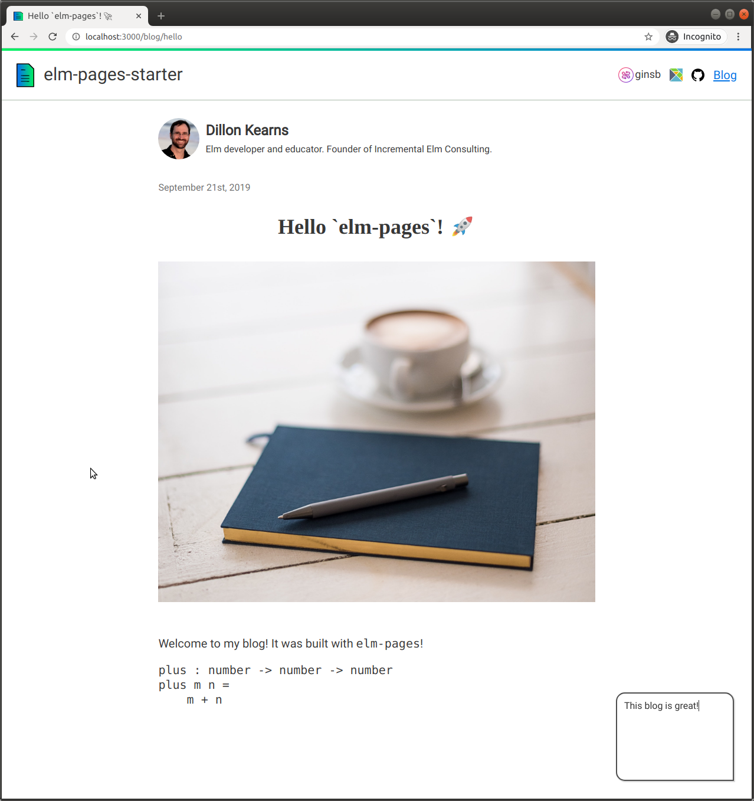
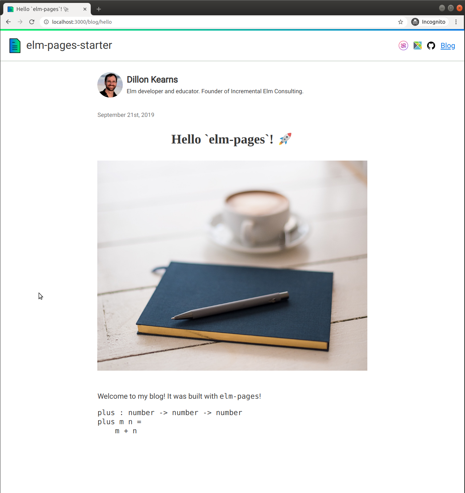

# Adding storage to an elm-pages app

## Adding storage to an elm-pages app

In this guide, we will show how to use Fission webnative storage to save user data. Our goal will be to add annotations to blog posts in the `elm-pages-starter`.

All of the code in this guide is available in the [fission-elm-pages-starter](https://github.com/bgins/fission-elm-pages-starter/tree/storage) repository on the `storage` branch.

When a user has signed in with Fission, an annotation button is displayed at the bottom right corner of the page.


Clicking the button opens a text input box where the user can write their notes.



If a user has not signed in, they do not see the annotation button or text input box.



Annotations are saved to the user's webnative filesystem and will be there when they return or use the app on another device.

### Write an annotation module

We will start off by writing an annotation module. `Annotation.elm` is built around an `Annotation` type and has a way to create, encode, and view annotations.

An `Annotation` can be editable or not. If an annotation is editable, it has a `title` and `notes`.

```text
type Annotation
    = Editable Internals
    | NotEditing


type alias Internals =
    { title : String
    , notes : String
    }
```

We have two ways of creating an annotation. A `NotEditing` annotation can be created directly. An `Editable` annotation must be created from a `Value` that will come over a port.

```text
notEditing : Annotation
notEditing =
    NotEditing


fromValue : Value -> Annotation
fromValue val =
    case Json.Decode.decodeValue internalsDecoder val of
        Ok internals ->
            Editable internals

        Err _ ->
            NotEditing

internalsDecoder : Decoder Internals
internalsDecoder =
    Json.Decode.map2 Internals
        (Json.Decode.field "title" Json.Decode.string)
        (Json.Decode.field "notes" Json.Decode.string)
```

Our code that interacts with the webnative filesystem will use blog post titles as keys to lookup and save annotations.

Add `encode` for storing annotations and `encodeTitle` for loading them.

```text
encode : Annotation -> Json.Encode.Value
encode annotation =
    case annotation of
        Editable internals ->
            Json.Encode.object
                [ ( "title", Json.Encode.string internals.title )
                , ( "notes", Json.Encode.string internals.notes )
                ]

        NotEditing ->
            Json.Encode.null


encodeTitle : String -> Json.Encode.Value
encodeTitle title =
    Json.Encode.object
        [ ( "title", Json.Encode.string title ) ]
```

Lastly, we need a way to view annotations. When a user is editing an annotation, we show their notes or the blog post title as a placeholder. When an annotation is not being edited, we show a button with a pencil icon.

Add a `view` function with a case for `Editable` and `NotEditing` annotations.

```text
view :
    { annotation : Annotation
    , title : String
    , onLoadAnnotation : String -> msg
    , onUpdateAnnotation : Annotation -> msg
    }
    -> Element msg
view options =
    case options.annotation of
        Editable annotation ->
            Element.row
                [ Element.alignBottom
                , Element.alignRight
                , Element.padding 30
                ]
                [ Element.Input.multiline
                    [ Element.height (Element.px 150)
                    , Element.width (Element.px 200)
                    , Border.width 2
                    , Border.roundEach { topLeft = 15, topRight = 15, bottomLeft = 15, bottomRight = 0 }
                    , Border.color (Element.rgb 0.5 0.5 0.5)
                    , Element.focused
                        [ Border.color (Element.rgb 0.3 0.3 0.3)
                        , Border.shadow
                            { offset = ( 1, 1 )
                            , blur = 1
                            , color = Element.rgb 0.85 0.85 0.85
                            , size = 1
                            }
                        ]
                    , Font.size 16
                    ]
                    { onChange =
                        \newText ->
                            options.onUpdateAnnotation
                                (Editable
                                    { title = options.title, notes = newText }
                                )
                    , text = annotation.notes
                    , placeholder =
                        Just
                            (Element.Input.placeholder []
                                (Element.text ("Write some notes on " ++ options.title))
                            )
                    , label = Element.Input.labelHidden ("Notes on " ++ options.title)
                    , spellcheck = False
                    }
                ]

        NotEditing ->
            Element.row
                [ Element.alignBottom
                , Element.alignRight
                , Element.padding 30
                ]
                [ Element.Input.button []
                    { onPress = Just (options.onLoadAnnotation options.title)
                    , label =
                        Element.row
                            [ Element.padding 8
                            , Border.width 2
                            , Border.rounded 50
                            , Border.color (Element.rgb 0.3 0.3 0.3)
                            ]
                            [ Element.image
                                [ Element.width (Element.px 30)
                                ]
                                { src = ImagePath.toString Pages.images.annotation
                                , description = "Annotate with Fission"
                                }
                            ]
                    }
                ]
```

### Add annotations

Now that our annotation module is ready, we can add annotations to the `elm-pages-starter`.

We want the user to see the annotation button when they navigate to a page with a blog post. When they click on the annotation button, we load the annotation from their webnative filesystem or an empty annotation if they are starting a new annotation. We replace the button with the notes in a text input box.

We save the annotation to webnative with each keystroke the user makes in the text input box.

Import the annotation module in `Main.elm`.

```javascript
import Annotation exposing (Annotation)
```

Add an `annotation` to the `Model`.

```javascript
type alias Model =
    { username : Maybe String
    , annotation : Annotation
    }
```

We only display one annotation at a time, which means we can replace `annotation` when we navigate to a new page or load an annotation.

The annotation starts off as `NotEditing` in `init`.

```javascript
init : ( Model, Cmd Msg )
init =
    ( { username = Nothing
      , annotation = Annotation.notEditing
      }
    , Cmd.none
    )
```

Our `update` will handle four messages that initialize, load, or store annotations. `OnPageChange` sets the annotation to `NotEditing` when a user navigates to a new page. `LoadAnnotation` calls over a port to load an annotation. `UpdateAnnotation` updates the displayed annotation in the input box and stores the annotation. `GotAnnotatation` subscribes to annotations that come in over a port after a load.

```javascript
type Msg
    = SubmittedLogin
    | GotAuth (Maybe String)
    | OnPageChange
        { path : PagePath Pages.PathKey
        , query : Maybe String
        , fragment : Maybe String
        }
    | LoadAnnotation String
    | UpdateAnnotation Annotation
    | GotAnnotation Annotation


update : Msg -> Model -> ( Model, Cmd Msg )
update msg model =
    case msg of
        SubmittedLogin ->
            ( model
            , login ()
            )

        GotAuth maybeUsername ->
            ( { model | username = maybeUsername }
            , Cmd.none
            )

        OnPageChange _ ->
            ( { model | annotation = Annotation.notEditing }
            , Cmd.none
            )

        LoadAnnotation title ->
            ( model
            , loadAnnotation (Annotation.encodeTitle title)
            )

        UpdateAnnotation annotation ->
            ( { model | annotation = annotation }
            , storeAnnotation (Annotation.encode annotation)
            )

        GotAnnotation annotation ->
            ( { model | annotation = annotation }
            , Cmd.none
            )
```

Our `main` function needs a small change to configure the `OnPageChange` message. Set the `onPageChange` field in the record passed to `Pages.Platform.init` to `Just OnPageChange`.

Add `loadAnnotation`, `onFissionAnnotation`, and `storeAnnotation` ports.

```javascript
port loadAnnotation : Json.Decode.Value -> Cmd msg


port onFissionAnnotation : (Json.Decode.Value -> msg) -> Sub msg


port storeAnnotation : Json.Decode.Value -> Cmd msg
```

Add a subscription to the `onFissionAnnotation` port.

```javascript
subscriptions : Model -> Sub Msg
subscriptions _ =
    Sub.batch
        [ onFissionAuth
            (\val ->
                Json.Decode.decodeValue authDecoder val
                    |> Result.toMaybe
                    |> GotAuth
            )
        , onFissionAnnotation
            (\val ->
                Annotation.fromValue val
                    |> GotAnnotation
            )
        ]
```

We create an annotation from the `Value` received over `onFissionAnnotation` and use `GotAnnotation` to update our model with it.

Pass the annotation and two messages to tell it how to load and update annotations to `Layout.view`.

```javascript
    Layout.view
        (pageView model siteMetadata page viewForPage)
        page
        { loginMsg = SubmittedLogin, username = model.username }
        { annotation = model.annotation
        , onLoadAnnotation = LoadAnnotation
        , onUpdateAnnotation = UpdateAnnotation
        }
```

In `Layout.elm`, the `view` displays the annotation at the bottom right corner and in front of the rest of the page. We check if the user is logged in and viewing a blog post. If both are true, we show them the annotation.

```javascript
view :
    { title : String, body : List (Element msg) }
    ->
        { path : PagePath Pages.PathKey
        , frontmatter : Metadata
        }
    ->
        { loginMsg : msg
        , username : Maybe String
        }
    ->
        { annotation : Annotation
        , onLoadAnnotation : String -> msg
        , onUpdateAnnotation : Annotation -> msg
        }
    -> { title : String, body : Html msg }
view document page fissionAuth annotationOptions =
    { title = document.title
    , body =
        Element.column
            [ Element.width Element.fill
            , Element.height Element.fill

            -- Maybe show the annotation
            , Element.inFront <|
                case fissionAuth.username of
                    Just username ->
                        case page.frontmatter of
                            Metadata.Article metadata ->
                                Annotation.view
                                    { annotation = annotationOptions.annotation
                                    , title = metadata.title
                                    , onLoadAnnotation = annotationOptions.onLoadAnnotation
                                    , onUpdateAnnotation = annotationOptions.onUpdateAnnotation
                                    }

                            _ ->
                                Element.none

                    Nothing ->
                        Element.none
            ]
            [ header page.path fissionAuth
            , Element.column

                [ Element.padding 30
                , Element.spacing 40
                , Element.Region.mainContent
                , Element.width (Element.fill |> Element.maximum 800)
                , Element.centerX
                ]
                document.body
            ]
            |> Element.layout
                [ Element.width Element.fill
                , Font.size 20
                , Font.family [ Font.typeface "Roboto" ]
                , Font.color (Element.rgba255 0 0 0 0.8)
                ]
    }
```

### Add webnative storage

Our app is ready for annotations and the last step is adding webnative storage.

Each Fission user has a filesystem that is stored locally and distributed across the web. An app that uses Fission storage asks the user for permission to use their filesystem -- similar to how a native mobile app asks for permission. After the app has been granted permission, it can store user data to their local filesystem and publish it to the distributed filesystem.

Let's start by installing the `webnative` package from npm.

```bash
npm install webnative
```

Import it in `index.js`.

```javascript
import * as webnative from 'webnative';
```

We initialize `webnative` with a list of permissions stating what our app would like to use. In our case, we only need to request permission to use the storage associated with our app.


**Shared storage:** The webnative filesystem also has public and private shared storage that can be accessed across apps. See the [webnative documentation](../../developers/webnative/#file-system) for more details.


Declare an `fs` variable that will be used to access the user's filesystem. Add `fissionInit` with a request for `permissions` to use app storage by app name and your Fission username.

```javascript
let fs;

const fissionInit = {
  permissions: {
    app: {
      name: 'fission-elm-pages-starter',
      creator: '<username>'
    }
  }
};
```

Replace `<username>` with your Fission username.

Next, we initialize `webnative`. In the `AuthSucceeded` and `Continuation` cases, the user has authenticated and granted permission to use the filesystem. We can now set up the filesystem and a way to load and store annotations.

```javascript
pagesInit({
  mainElmModule: Elm.Main
}).then(app => {
  webnative.initialize(fissionInit).then(async state => {
    switch (state.scenario) {
      case webnative.Scenario.AuthSucceeded:
      case webnative.Scenario.Continuation:
        app.ports.onFissionAuth.send({ username: state.username });

        // [1] Alias the filesystem from state
        fs = state.fs;

        // [2] Create the app directory if it does not exist
        const appPath = fs.appPath();
        const appDirectoryExists = await fs.exists(appPath);

        if (!appDirectoryExists) {
          await fs.mkdir(appPath);
          await fs.publish();
        }

        // [3] Load an annotation or send an empty one
        app.ports.loadAnnotation.subscribe(async ({ title }) => {
          const path = fs.appPath(['annotations', `${title}.json`]);
          if (await fs.exists(path)) {
            const annotation = JSON.parse(await fs.read(path));
            app.ports.onFissionAnnotation.send({
              title: annotation.title,
              notes: annotation.notes
            });
          } else {
            app.ports.onFissionAnnotation.send({
              title,
              notes: ''
            });
          }
        });

        // [4] Store and publish an annotation to the filesystem
        app.ports.storeAnnotation.subscribe(async annotation => {
          if (annotation !== null) {
            const path = fs.appPath([
              'annotations',
              `${annotation.title}.json`
            ]);
            await transaction(fs.write, path, JSON.stringify(annotation));
          }
        });
        break;

      case webnative.Scenario.NotAuthorised:
      case webnative.Scenario.AuthCancelled:
        break;
    }

    app.ports.login.subscribe(() => {
      webnative.redirectToLobby(state.permissions);
    });
  });
});
```

Annotations are stored in app storage in an `annotations` subdirectory as JSON. Each annotation is stored as a file using the blog post title and a `.json` suffix. For example, an annotation on the blog post "Hello Galaxy 🌠" would be stored on the path `annotations/Hello Galaxy 🌠.json`. Paths are case sensitive, spaces are fine, and emoji are welcomed!

Paths are built using `fs.appPath` which takes an array of strings that are parts of a path separated by forward slashes.

The numbered references in the code go as follows:

1. **Alias the filesystem from state.** We alias `state.fs` as `fs` to put it onto the global scope.
2. **Create the app directory if it does not exist.** A new user will not have a directory for our app. Check if the directory exists and make one if not with `fs.mkdir`. Each time we make a change to the local filesystem, we `fs.publish` to synchronize with the distributed filesystem.
3. **Load an annotation or send an empty one.** When the Elm app sends a message over the `loadAnnotation` port, we make check if a file for the annotation exists. If it does, we `fs.read` and send it over the `onFissionAuth` port into the Elm app. If not, we send an empty annotation value.
4. **Store and publish an annotation to the filesystem.** When the Elm app sends a message over the `storeAnnotation` port, `webnative` saves the annotation to the filesystem with `fs.write`. The current implementation uses a transaction queue to handle writes that come in quick succession. See the [transaction queue implementation](https://github.com/bgins/fission-elm-pages-starter/blob/dbf041f767c8b5e409c661c00a52fa84b6c9dab4/index.js#L89-L134) to examine how this works now. An upcoming version of `webnative` will handle writes in parallel, and the transaction queue will not be needed.

### Write some notes! 📝️

Everything is in place and users can write their notes about blog posts! Annotations persist across visits to the blog and are available on any device where the user has logged in with Fission.

We haven't covered shared storage in this guide, but you can do much more when user data is not restricted to a single app. With shared private storage, you could write an app that shows users their annotations from multiple apps across the web. With shared public storage, you could convert annotations into a publicly visible comments!

For more information on how Fission storage works, take a look at:

* [File System section in Fission whitepaper](https://whitepaper.fission.codes/file-system/file-system-basics)

