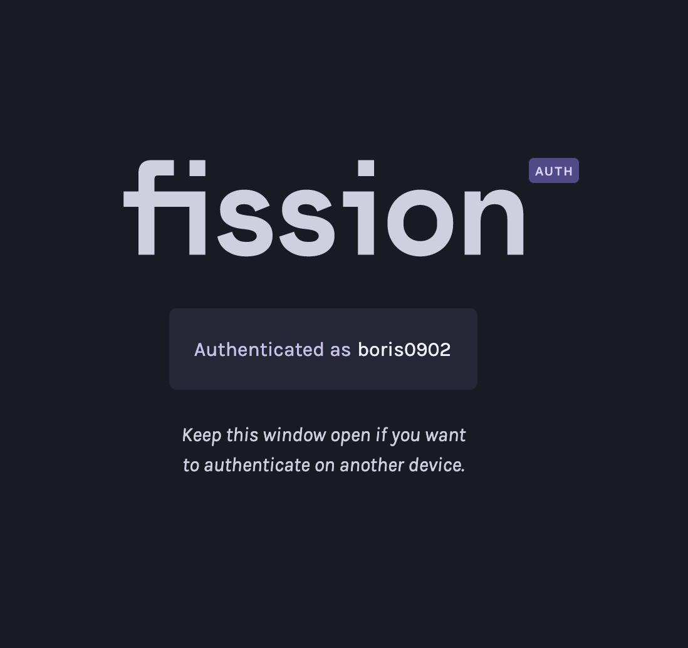

# Account Linking

## Web Linking

To have access to your account across multiple devices, you need to link them. 

When you visit an app on a new device and **Sign in with Fission**, or if you go directly to the Fission Auth page, you'll be prompted to either create a new account or link an existing one:

If you have an account already, click the sign in button:

The only thing you need to know is your username. Enter it, and hit the link account button:

As you can see, you are now being asked to open the Fission Auth page on your other device. This might be your other computer or perhaps your phone. There is also a short message telling us that this is for the `boris0902` username.

Once you open the Fission Auth page on your other device, it will detect the linking request and display a page like this.

The new device you are linking should show the same numbers:

Since we can see the numbers are the same, we can go ahead and hit the "Approve" button, and you'll see this success message.

Switching to the new device you were linking, you'll see this message:

Now you can use either device with full authorization

And yes, this works on mobile too:

## Command Line Linking

Linking accounts on the command line is not yet implemented. [Follow this Github issue »](https://github.com/fission-suite/fission/issues/390)

