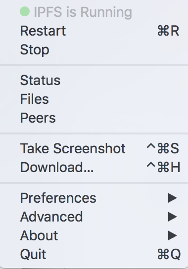

# Installing IPFS

We build on top of decentralized web technologies like the InterPlanetary File System \(IPFS\) to publish directly from your local development environment without having to learn complicated deployment or DevOps techniques.

Right now you need to install IPFS as well as the Fission command line tool to get up and running, but it should just take a couple of minutes if you follow these instructions.

### ipfs-desktop

[ipfs-desktop](https://github.com/ipfs-shipyard/ipfs-desktop) is a great option for a graphical interface, including options to run ipfs as a service on system start, as well as easy access to start and stop the ipfs daemon.

You can download the [release from their Github page](https://github.com/ipfs-shipyard/ipfs-desktop/releases) or use your favourite package manager:

* Homebrew \(macOS\): `brew cask install ipfs` 
* Snap \(Linux / WSL\): `snap install ipfs-desktop` 


The command line ipfs daemon is also included as part of the ipfs-desktop install.


### Command Line IPFS

#### MacOS

If you're not running ipfs-desktop, install ipfs via brew:

```bash
brew install ipfs
```

To run ipfs as a background service:

```bash
brew services start ipfs
```

#### Linux and Windows / WSL

Download the Linux binary from the [IPFS distributions page](https://dist.ipfs.io/#go-ipfs).

Untar the archive and run the `./install.sh` script \(which just moves the binary to a local bin path\).

```bash
$ tar xvfz go-ipfs.tar.gz
$ cd go-ipfs
$ ./install.sh
```

### All Systems

For all systems, IPFS should now be installed. Initialize your IPFS repo:

```bash
ipfs init
```

By default the config and files are stored in your home directory in the`~/.ipfs` directory.

ipfs-desktop can be turned on and off graphically:



For Linux systems, run the daemon in the background:

```bash
ipfs daemon &
```

If you would like to be able to easily start and stop the ipfs daemon, see the [Troubleshooting page](../../appendix/troubleshooting.md#initd).

