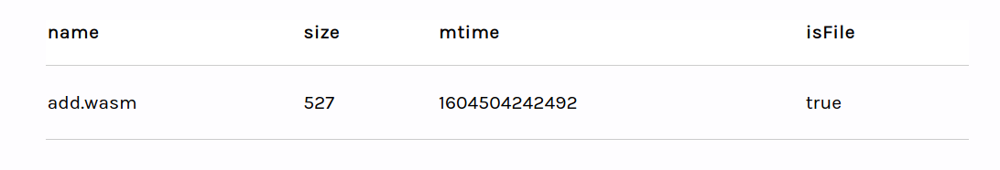

# Storing WebAssembly Modules

## Storing WebAssembly Modules

In this guide, we will show how to store WebAssembly modules in Fission web native storage. Our goal will be to store a WASM module and execute it at a later time.

The code in this guide is available in the [stored-wasm-example](https://github.com/fission-suite/stored-wasm-example) repository and the example is published at [quick-enormous-silicon-dinosaur.fission.app](https://quick-enormous-silicon-dinosaur.fission.app).

We have compiled an `add` function from C to a WASM module.

```c
  int add(int x, int y)
  {
    return x + y;
  }
```

Our example app will make a GET request for `add.wasm` and store it in web native storage. We will list the contents of the directory where the module is stored to confirm it is there. Finally, we will load the module from storage and add some numbers!


Our example uses some helper functions to add interactivity. We won't cover calls to `dom.reveal()`, `dom.hide()`, or `dom.updateFirstChild().` If you would like to see what these do, please take a look at the code in the repository.



At the moment, this example will not work in webKit iOS or Safari macOS browsers. If you are familiar with WebAssembly in these browsers, we would love some help with this! See the [SyntaxError invalid character in webkit/safari](https://github.com/bgins/fission-stored-wasm-example/issues/1) issue for more details.


### Authenticate the user

Before we can store a WASM module, we need to initialize `webnative` and ask the user for permission to use their web native file system. This example asks for permission to use app storage and uses `fs` as an alias for the file system after we initialize.

```javascript
let fs;

const fissionInit = {
  permissions: {
    app: {
      name: 'fission-wasm-example',
      creator: 'bgins'
    }
  }
};
```

We pass `fissionInit` to `webnative` and get back a `state` that tells us if the user has authenticated or not.

```javascript
webnative.initialize(fissionInit).then(async state => {
  switch (state.scenario) {
    case webnative.Scenario.AuthSucceeded:
    case webnative.Scenario.Continuation:
      fs = state.fs;

      // Show the previous result if we have one
      const resultPath = fs.appPath(webnative.path.file('results', 'add'));
      if (await fs.exists(resultPath)) {
        const stored = JSON.parse(await fs.read(resultPath));
        revealStoredResult(stored);
      }

      dom.hide('loading-animation');
      dom.reveal('store');
      break;

    case webnative.Scenario.NotAuthorised:
    case webnative.Scenario.AuthCancelled:
      dom.hide('loading-animation');
      dom.reveal('auth');
      break;
  }
```

In the `AuthSucceeded` and `Continuation` cases, the user gave our app permission to use their file system. Otherwise, they have not been asked or they declined.

The user may have already stored `add.wasm` and used it to add numbers on a previous visit, so we check and display a stored result if we have one.

If the user has not authenticated, we show them a Sign In button that will redirect them to the Fission auth lobby.

```javascript
    webnative.redirectToLobby(state.permissions);
```

### Request and store the module

After authentication, we are ready to request `add.wasm` and store it in web native storage.

```javascript
  const store = async () => {
    dom.reveal('loading-animation');

    fetch('add.wasm').then(response =>
      response.arrayBuffer().then(async buffer => {
        if (fs) {
          const path = fs.appPath(webnative.path.file('wasm', 'math', 'add.wasm'));
          const blob = new Blob([buffer], { type: 'application/wasm' });
          await fs.write(path, blob);
          await fs.publish();

          dom.hide('store-button-row', 'loading-animation');
          dom.reveal('list');
        }
      })
    );
  };
```

We fetch `add.wasm` and stream the `Response` into an `ArrayBuffer`. It will be stored as a `Blob` in app storage at the path `wasm/math/add.wasm`.

We prepare a `path` and `blob`, write the blob to the local file system, and publish it to the user's wider file system across the web. After we publish, the module is available on any device where the user has set up web native storage.

### List directory contents

Next, we can check to make sure the module has been saved in storage.

```javascript
    if (fs) {
      const directoryPath = fs.appPath(webnative.path.directory('wasm', 'math'));
      const directoryListing = await fs.ls(directoryPath);
      Object.keys(directoryListing).forEach(function (key) {
        appendRow(directoryListing[key]);
      });

      dom.hide('list-button-row');
      dom.reveal('contents');
    }
```

This time we prepare a `wasm/math` path for the directory and call `fs.ls` to list its contents. We take each entry in the directory listing and append its metadata to a table.



Each entry has a name, size (in bytes), last modified time, and a flag indicating whether it is a file or directory.

### Load and use the module

The module is in storage and we are ready to use it! Each time a user submits `lhs` and `rhs` numbers, we load `add.wasm` and add their numbers.

```javascript
    if (fs) {
      if (!Number.isNaN(lhs) && !Number.isNaN(rhs)) {
        const path = fs.appPath(webnative.path.file('wasm', 'math', 'add.wasm'));
        if (await fs.exists(path)) {
          const buffer = await fs.read(path);
          WebAssembly.instantiate(buffer).then(async wasmObject => {
            const result = wasmObject.instance.exports.add(lhs, rhs);
            dom.updateFirstChild('result', result);

            const resultPath = fs.appPath(webnative.path.file('results', 'add'));
            const computation = { lhs, rhs, result };
            await fs.write(resultPath, JSON.stringify(computation));
            await fs.publish();

            dom.reveal('everywhere');
          });
        }
      } else {
        dom.updateFirstChild('result', '🤖🤖💥');
      }
```

After some input validation, we prepare the `wasm/math/add.wasm` path, make sure a module exists at that path, and read it into a buffer. We instantiate the WASM module and call the `add` function off it.

Earlier we mentioned that storing the module makes it available across the web. Why not do the same for our result? We store the result at the path `results/add`, and now both the module and the last result are available on any device!

### Deleting the module and result

We can delete the module and result from storage to reset our example.

```javascript
    if (fs) {
      const funcPath = fs.appPath(webnative.path.file('wasm', 'math', 'add.wasm'));
      const resultPath = fs.appPath(webnative.path.file('results', 'add'));
      await fs.rm(funcPath);
      await fs.rm(resultPath);
      await fs.publish();

      dom.hide('loading-animation')
      dom.reveal(
        'store',
        'store-button-row',
        'list-button-row',
        'show-run-button-row'
      );
    }
```

We prepare paths for the module and result and use `fs.rm` to delete them. Lastly, we publish the deletion to remove them from the wider file system.

### Store once, compute once

Storing WASM modules and results means you only need to request a module or perform a computation once. The web native file system will sync modules and results across user devices automatically. This opens up many opportunities to simplify your applications and sync app data across user devices.

Reading this guide gives you a taste of how this all works, but extending this example will take you much further! Here are a couple of suggested exercises that will help you to get started with web native.

* **Add a subtraction operation.** We have done addition, adding subtraction would be an easy first step. See [Compiling C to WebAssembly without Emscripten](https://surma.dev/things/c-to-webassembly/) for help with compiling WASM modules.
* **Distributed addition.** How about instead of overwriting the result of an addition, we keep a running total across devices?
* **Build a calculator.** A bit more ambitious, but a calculator app that stores state across devices would be so cool!
